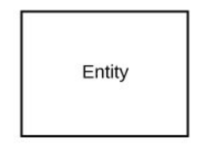
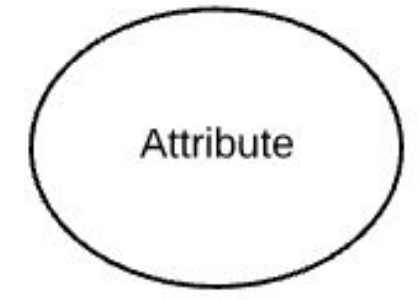
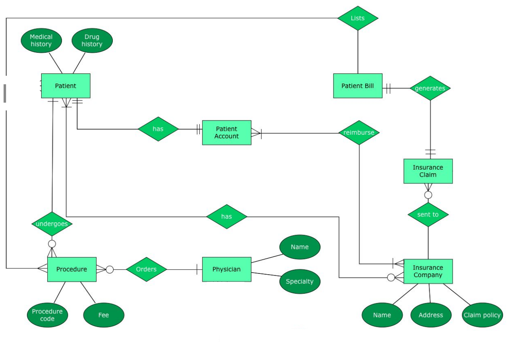

## Unit 2: Database Systems Fundamentals

## Introduction

In Unit 2, we explored fundamental database concepts that form the basis for designing and working with database systems. Through lessons on entity-relationship diagrams, relational models, schema translation, and relational algebra, I gained valuable insights into how databases function and why their design is crucial for efficiency and data integrity.

## Key Takeaways:

## 1.Entity-Relationship Diagrams (ERDs):
 I learned that ER diagrams are graphical representations of a database's structure. They show the relationships between entities, which are actual things or objects. Since ER diagrams helps in visualizing the data model before implementation, understanding them is essential. It facilitates effective database design by displaying entities, attributes, and relationships.
 
 Components of ERD;

a. Entities: Represent objects or concepts in the real world, such as "Customer" or "Order."

b. Attributes: Describes the properties of entities. For example, a "Customer" might have attributes like "Name" or "Address."

c. Relationships: Show how two entities are related to each other, like "Customer places Order."

 ## 2.Identify Complex Attributes: 

 Complex attributes refer to attributes that either contain multiple values (multivalued attributes) or are made up of other attributes (composite attributes). I learned how to identify these complex attributes in a data model and how they can be handled effectively during database design.

Complex attributes:

## Composite Attributes

In composite attributes the attributes are made up of smaller sub-attributes. For example in the digram, an "Name" attribute contain sub-attributes like "FName", "MName", and "LName."

## Multivalued Attributes

In the multivalued attributes the attributes hold multiple values for a single entity. for example in the digram, a "Degree" attribute for a employee might store multiple degrees.

## 3.Map Cardinalities Between Entities:
 
 Cardinalities define the numerical relationship between two entities. To accurately depict how entities interact with one other mapping cardinalities is essential. I learned that understanding these relationships helps in determining how data is stored and retrieved, which is an essential part of creating a useful database.

 Types of Cardinalities;

a. One-to-One.

b. One-to-Many.

c. Many-to-Many.

d. One-to-None.

 

 The diagram illustrates different types of relationships between the Instructor and Student entities through the intermediary entity Advisor. The cardinality of relationships defines how instances of one entity are related to instances of another.

## 4.Determine Primary Keys in Entity Sets:

Every record in a database is uniquely identified by its primary key. I learned that choosing the right primary key for an entity set is essential to guaranteeing the distinguishability of every entity instance. This avoids duplicate records and guarantees data consistency and a minimal, stable, and unique primary key is ideal.

*Visual representation ofPrimary Key within an Entity-Relationship (ER) Model.*

## 5.Remove Redundant Attributes:

Redundant attributes are those that repeat the same information within a database. I learned that removing redundant attributes is important for normalization, which optimizes the database structure by minimizing duplication. It reduces data anomalies and ensures that the database remains efficient and easy to maintain.

## 6.Database Design Process:

 I learned the process of designing relational databases understanding the relational model structure, schema diagrams, and the steps involved in reducing entity-relationship (E-R) diagrams to relational schemas. The design process also incorporates understanding guidelines for deciding between entities, attributes, and relationships, which helps ensure clarity and accuracy in the database schema.

*visually represent the relationships between entities and their attributes*

*shows how tables and their relationships are structured in the relational model.*

## 7.Relational Data Models:

I explored a deep dive into relational data models, including essential relational database terms, such as tables, attributes, and tuples. I learned how the relational model organizes data and enforces integrity through constraints. Understanding relational model keys (primary, foreign, and other types of keys) was fundamental in knowing how relationships are maintained within a database.

## 8.Entity-Relationship Diagrams (ERD):

I gained an understanding of how to map ER diagrams to relational schemas and how to use schema diagrams effectively to represent database structures. This skill is crucial in visualizing the relationships between entities and ensuring that the database design is aligned with the data requirements.

 ### What I Learned and Why It Matters

This unit gave me a solid understanding of the relational model and all of its key elements, such as constraints, schema diagrams, and relational keys. Accurately capturing real-world situations in databases requires the ability to recognize complex attributes and map relationships, such as aggregations and specializations, to relational tables.

The unit also emphasized the significance of relational query languages, which are necessary for querying and modifying data in relational databases. These query languages include relational algebra operations such as SELECT, PROJECTION, UNION, and JOIN. Working with large databases, optimizing queries, and guaranteeing data efficiency and integrity all depend on this understanding.

I'm also comfortable creating well-structured, normalized databases because I know the distinctions between entities, attributes, and relationships, as well as how to use schema diagrams and unified modeling languages (UML).

## Personal Growth and Reflection

My knowledge of relational databases and their design principles has grown as a result of this unit. Whether it is through diagramming, key identification, or relational algebra querying, I now feel far more prepared to build and work with relational databases. I have no doubt that the knowledge I have acquired will help me in upcoming database-related projects, both professional and academic.

As I consider the significance of neat, orderly data structures, I realize how important database design procedures are to guaranteeing the integrity and effectiveness of systems. I feel more equipped to tackle more complex database tasks, like handling big datasets, streamlining data through intricate systems, and optimizing queries.

Thank You.

