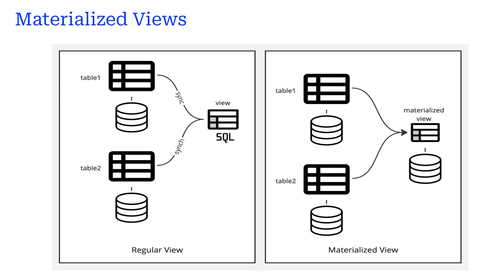

## Topic: Database Systems Fundamentals

This unit introduced advanced SQL concepts that are commonly used in real-world database systems. The focus of this unit was on understanding joins, views, transactions, constraints, indexing, and automation using functions, procedures, and triggers. It also covered security through authorisation and working with recursive and aggregated queries. These topics built on the basics from earlier units and expanded my ability to work with more complex and efficient database structures.

## Key Takeaways:

### 1. Implement Different Types of Joins in SQL.

I explored various types of SQL joins — INNER JOIN, LEFT JOIN, RIGHT JOIN, and FULL OUTER JOIN. Understanding how these joins work has helped me merge and retrieve related data from multiple tables. 

Before this unit, I used to rely on simple queries. Now, I understand how to use joins to create more meaningful relationships between tables — this especially came in handy when i was working on the voter registration system schema.

### 2. Create and Implement SQL Views.

I learned how to create views that provide a simplified and abstracted way to interact with complex queries and also that views can also be used to restrict user access to specific columns.

This diagram explains how views can be used as a layer for authorization and abstraction.

### 3. Understand SQL Transactions.

Transactions are essential for maintaining data integrity. I learned the four ACID properties (Atomicity, Consistency, Isolation, Durability), and how to use commands like BEGIN, COMMIT, and ROLLBACK.

Using transactions helped me ensure that multi-step operations are either fully completed or fully rolled back — reducing errors.

###  4. Implement Integrity Constraints in SQL to Maintain Data Consistency.

I learned that integrity constraints such as PRIMARY KEY, FOREIGN KEY, CHECK, NOT NULL, and UNIQUE help maintain clean and consistent data.

Integrity Constraints;

1. Entity Integrity Constraints
2. Domain Constraints
3. Referential Integrity Constraints
4. Key Constraints

### 5. Implement Indexes Using SQL Statements.

Indexes are powerful tools to speed up queries. I practiced creating indexes and saw performance improvements during complex SELECT operations.

- Example from (Electronic Health Database System)

I learned to balance between improving performance and avoiding unnecessary overhead due to too many indexes.

### 6. Define SQL Data Types and Schemas

I learned about defining proper data types for each column (INT, VARCHAR, BOOLEAN, etc.) and organizing database objects using schemas, and i also learned new concepts like;

  - PostgreSQL-specific types like TEXT, BYTEA, and large objects.

  - Use of schemas and catalogs for logical separation.

  - Creating user-defined types to represent custom structures.

### 7. Understand SQL Authorization Concepts

I explored how privileges can be granted and revoked at various levels — on roles, views, schemas, and even rows and some important things like:

   - GRANT and REVOKE commands

  - Transfer of privileges and authorization graphs

  - Row-level security to control access per record

  
  This visual explains how roles, schemas, and views interconnect with privileges and grants.

### 8. Implement Functions and Procedures in SQL

I learnded that functions and procedures help automate tasks and encapsulate logic, and  I also Practiced:

  - Creating SQL functions using CREATE FUNCTION

  - Writing procedures for multi-step logic

  - Understanding the difference between functions (return values) and procedures (perform actions)

### 9. Implement Triggers in SQL

Triggers allow automatic actions in response to changes in the database and I also learnded;

  - Syntax for defining triggers

  - Use cases such as logging or validation

  - When not to use triggers — especially for performance reasons

### 10. Access SQL from a Programming Language

I learned how SQL can be used with general-purpose languages like Java or Python to perform tasks SQL alone can’t handle — such as generating reports or user interaction.

- Dynamic SQL lets programs build and run SQL queries at runtime using interfaces like ODBC and JDBC.

- Embedded SQL involves writing SQL inside code, which is then translated into database function calls at compile time.

 
This diagram illustrates both Dynamic and Embedded SQL models with JDBC and ODBC interfaces and how they help bridge SQL with full-fledged applications.

### 11. Write Recursive Queries in SQL

I learned how to write recursive queries using WITH RECURSIVE for hierarchical data. A recursive query has a base and a recursive part, and I explored transitive closure for indirect relationships. I also learned that recursive queries must be monotonic, meaning they can’t use aggregation or NOT EXISTS that might break the recursion.

### 12. Use Advanced Aggregation Features in SQL

I explored:

  - Ranking: Using RANK() and DENSE_RANK()

  - Windowing: OVER() clause for moving averages and totals

  - Pivoting: Reshaping data using crosstab()

  - Rollup & Cube: For multi-level aggregations

These advanced features brought a new layer of flexibility to how I summarize and analyze data.

### What I learned and Why it Matters:

In Unit 4, I dove deep into the advanced features of SQL, going beyond just writing simple queries. I learned how to structure and maintain robust databases using joins, views, integrity constraints, and indexes. Understanding SQL authorization helped me grasp the importance of database security, while learning about triggers, recursion, and stored procedures showed me how to automate and optimize operations.

Accessing SQL from a programming language also stood out — it revealed how SQL integrates with real-world applications, making it a powerful tool in dynamic environments. These lessons matter because they bridge the gap between theoretical database design and practical implementation. The knowledge and skills from this unit are foundational for building efficient, secure, and scalable data systems — which are crucial in almost every modern tech-driven field.

###  Personal Growth and Reflection

At the start of this unit, I saw SQL as just a query language. But now, I understand it as a comprehensive system for managing data with precision and control. I’ve become more confident in writing complex SQL statements, designing secure and logical schemas, and thinking critically about data access and manipulation.

Working on real examples like the voter registration system challenged me to go beyond syntax — to consider things like performance, user roles, and how databases interact with other programs. I realized that small decisions, like setting up constraints or defining access levels, can have a huge impact on data quality and system reliability.

Overall, this unit has been a leap forward in both my technical and analytical thinking. I’m now better prepared to handle real-world database challenges — and I’m genuinely excited to keep building on this foundation.

### Thank you
