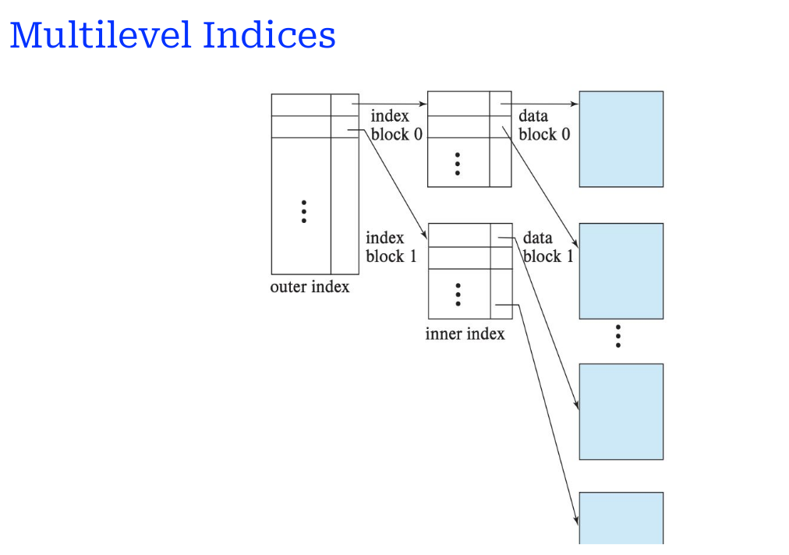
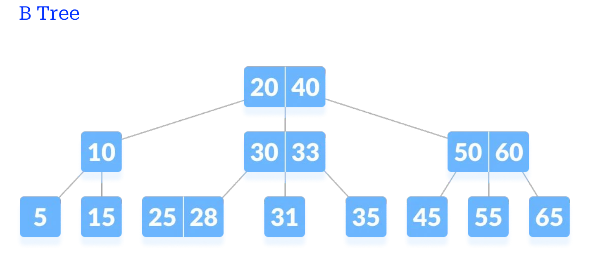

## Topic: Database Systems Fundamentals

### Introduction

This unit  focused on some of the most important concepts that help databases run efficiently—indexing and query optimization. We explored how different types of indexes improve data retrieval speed, how queries are processed and evaluated, and how databases decide the most efficient way to run a query. This unit helped me see beyond writing SQL and into how databases actually work under the hood, giving me a deeper understanding of performance and design considerations.

###  Key Takeaways;

### 1.  Indexing and Its Types

In this unit, I learned that indexing is a powerful way to speed up data retrieval in databases. There are different types of indices such as primary, secondary, ordered, and hash-based indices. Each type is suitable for different scenarios. For instance, ordered indices are best for range queries, while hash indices are great for equality checks. Indexing reminded me a lot of how a book’s index helps you find information faster—only in databases, it’s a critical performance tool.

### 2. Multilevel and Secondary Indices

I also learned about multilevel indexing, which reduces the size of index files and improves access time by adding levels—like a tree of indexes pointing to other indexes. Secondary indices, on the other hand, help when the search key is not the primary key. These techniques are useful when managing large datasets that can’t be indexed in one flat structure. I now understand how databases optimize speed while handling massive amounts of records.

*The diagram illustrating the structure of multilevel indices in a database system.*

### 3. B-Trees and B+ Trees

B-Trees and B+ Trees were major concepts in this unit. These are self-balancing tree structures that maintain sorted data and allow searches, insertions, and deletions in logarithmic time. B+ Trees are widely used in databases because all the data is stored in the leaf nodes and linked together for easier sequential access. We also compared B-Trees and B+ Trees to understand their structure, advantages, and why B+ Trees are preferred in databases. I found the visual diagrams really helpful here.

*The diagram shows the structure and nodes of a B-Tree used for indexing in databases.*

###  4. Hash Indices and Hashing

Hashing is another indexing method we covered, where values are mapped using hash functions into buckets. I learned about static and dynamic hashing, how to choose the number of buckets, and how hashing works behind the scenes. Unlike B-Trees, hashing is best for simple, exact-match lookups. It was interesting to see how indexing strategies can change depending on the nature of the queries.

### 5. Query Processing Steps

This part of the unit was an eye-opener. We often write SQL and expect results, but now I understand what actually happens: parsing, translation, optimization, and execution. We studied logical and physical query plans and how the database decides the best execution method. The diagrams made it easier to follow how a query travels from being written to being executed by the system.

*The diagram illustrating the key steps involved in query processing within a database system.*

### 6.  Query Evaluation and Cost

We also learned how the cost of evaluating a query is measured in terms of disk I/O, CPU time, and memory use. I learned how different selection methods (file scan vs. index scan), sorting operations, joins, and set operations contribute to overall query cost. Knowing this made me appreciate how important query design is for database performance, especially with complex queries.

*The diagram illustrate the query evaluation steps, including parsing, logical and physical plan selection, execution, and interaction with disk storage.*

## 7. Query Execution Strategies

The concepts of materialization and pipelining were introduced to explain how intermediate results are handled. In materialization, results are stored before passing to the next operation, while in pipelining, results are passed directly. I also learned about how continuous data streams and cache-conscious algorithms are used to process queries more efficiently. This gave me an understanding of real-world database execution strategies.

### 8. Query Optimization Techniques

Finally, we studied how databases optimize queries using transformation rules and cost estimates. I now know that a single query can be executed in many different ways, and the database chooses the cheapest one using statistics and heuristics. We also learned about join ordering and how it can dramatically impact query performance. This topic showed me that writing efficient queries isn’t just about syntax—it’s about understanding how databases think.

*The diagram illustrates the process of evaluating various join orders to determine the most efficient query execution plan.*

### What I Learned and Why it Matters:

This unit helped me move beyond the basics of SQL and gave me real insights into how query execution works inside a database system. It matters because in any real-world application, performance is key. Learning about indexing, query costs, and optimization strategies prepares me for designing faster, more efficient systems. These skills are especially useful in backend development, database administration, and data analytics, where performance can make or break an application. I now have a solid foundation for understanding and improving database queries.

## Personal Growth and Reflection:
Before this unit, I never gave much thought to how queries are processed or why certain queries are slow. Now, I realize there’s a whole world of logic and algorithms behind every SELECT statement. I’ve grown in my ability to think critically about query performance and understand trade-offs between different query strategies. I also enjoyed working with diagrams and examples that showed how trees and hash functions work in practice. This unit made me more confident in my understanding of advanced database concepts and more aware of what goes on under the surface in any database system.

## Conclusion
This unit has deepened my understanding of how databases function efficiently through the use of indexing, query processing, and query optimization techniques. Learning about data structures like B-Trees and B+ Trees, as well as hashing and cost-based query optimization, has shown me the importance of performance-aware database design. I now appreciate the complexity behind seemingly simple data retrieval actions and the role that efficient algorithms and strategies play in making database systems scalable and responsive. This unit has given me both theoretical insight and practical knowledge that will support my future work with databases.

Thank You

